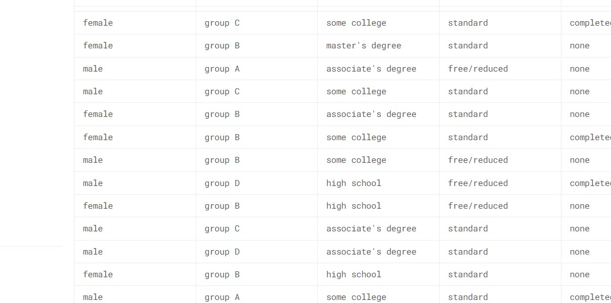
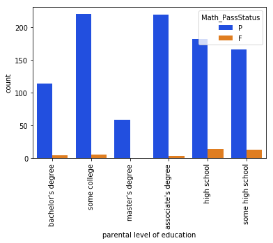
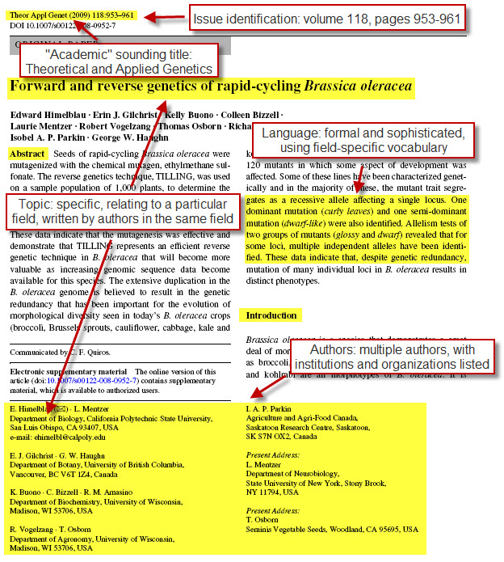
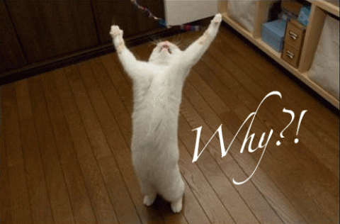

```{r setup, include=FALSE}
knitr::opts_chunk$set(echo = FALSE, fig.retina = 3, warning = FALSE, message = FALSE)

```

## R Markdown

- R Markdown is a tool we use to create

  - **efficient reports**
  - **summarize analyses**
  - **communicate results**

- it can easily produce

  - **HTML** documents
  - **PDF** documents
  - **presentations** (such as this one!)
  
- R Markdown ensures that the **results are reproducible**.

---


.pull-left[
  
  
  ]
  
.pull-right[



]

---

.center[]


---


## With R markdown results are always reproducible

```{r, echo=F}
```

---

## Slide with Plot

```{r pressure, echo = TRUE}
plot(pressure)
```


## R Markdown elements

- **Code**
- **Text** of the report
- **Metadata** for the file


